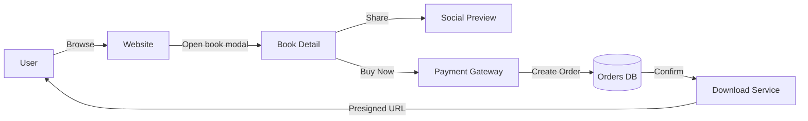

<p align="center">
	
</p>

# The Bookworm

[](https://nextjs.org)
[](https://reactjs.org)
[](https://www.typescriptlang.org)
[](https://nodejs.org)
[](https://www.mongodb.com/atlas)
[](https://developers.cloudflare.com/r2/)
[](https://playwright.dev)

One-stop shop for hand-picked digital books — buy once, download instantly, keep forever.

---

## What's included / What it does

- Server-rendered Next.js app (App Router)
- Book catalogue (MongoDB via Mongoose) with deterministic ratings and detail views
- Shareable book links that render proper Open Graph/Twitter metadata and a proxied cover image (`/api/og-image?id=<bookId>`)
- Integrated payment flow using Nylon Pay (`/api/checkout/initiate`) and secure time-limited downloads via presigned R2 URLs (`/api/download`)
- PWA-ready (service worker + manifest) — installable on mobile & desktop
- Responsive design with mobile-first refinements and accessible components

---

## Tech stack (interactive)

Click a badge to learn more about each component used here.

- Frontend: [Next.js](https://nextjs.org), React, TypeScript
- Backend / API: Next.js API routes, Node.js
- Database: MongoDB (Mongoose)
- Object storage: Cloudflare R2 (proxied via `src/app/api/og-image/route.ts` and used for book asset storage)
- Payments: Nylon Pay (`@nile-squad/nylonpay-ts`) — see `src/app/api/checkout/initiate/route.ts`
- Testing: Playwright (visual & layout checks used during development)

---

## Quick start (local development)

1. Install dependencies

```bash
npm install
```

2. Copy environment variables (see `.env.example` or the list below) and start the dev server

```bash
cp .env.example .env.local
npm run dev
```

Open http://localhost:3000

Important environment variables used in this project:

- `NEXT_PUBLIC_SITE_URL` — public site URL used when generating absolute links and metadata
- `R2_BUCKET_NAME` — Cloudflare R2 bucket name
- `NYLON_PAY_API_KEY`, `NYLON_PAY_API_SECRET` — Nylon Pay credentials for initiating collections
- Any MongoDB connection URI used by `src/lib/db.ts`

---

## Sharing books / social previews

Share a book with the URL format:

```
https://<your-site>/?book=<BOOK_ID>
```

This route populates Open Graph metadata in `generateMetadata` and points social crawlers at `/api/og-image?id=<bookId>` so previews include the book cover.

---

## How to use (mermaid)



---

## Install as a PWA

- Chrome / Edge / Brave: open the site, click the browser menu (⋮) → "Install app" or the install icon in the address bar.
- Safari (iOS): open the site, tap Share → "Add to Home Screen".
- After installation the app launches in a standalone window with an app icon.

The site includes `manifest.webmanifest` and a service worker (`public/sw.js`) to enable offline and install behavior.

---

## Usage notes

- When a purchase is completed, the backend creates an `Order` and the client can request a presigned download URL from `/api/download` (the endpoint verifies the order status before signing).
- The `/api/og-image` route streams the image bytes from R2 so crawlers receive the cover image without redirects.

---

## Credits

Built by the RENOA team.

- Design & Engineering: RENOA Collective
- Repo & code: The Bookworm project

If you'd like, I can also:

- add a small `.env.example` listing the expected env vars,
- add a `/books/[id]` permalink route that produces the same metadata, or
- generate a one-click share image preview screenshot for the README.

---

## License

This repository does not include an explicit license file. Add one if you intend to open-source the project.

---

Happy reading!
