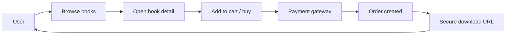

<p align="center">
  
</p>

# The Bookworm

A modern digital bookstore for discovering, buying, and downloading books with ease.

[](https://nextjs.org)
[](https://react.dev)
[](https://www.typescriptlang.org)
[](https://www.mongodb.com/atlas)
[](https://developers.cloudflare.com/r2/)

The Bookworm is a storefront and digital library where users can browse curated titles, explore book details, make purchases, and instantly access downloadable content.

---

## What the app does

- Shows a premium bookstore homepage with a hero section, book grid/list views, and filters
- Lets users search and browse books by title, author, and category
- Opens a detailed book modal with a description, pricing, and recommendations
- Supports adding books to cart and checking out through the payment flow
- Provides downloadable content after purchase using secure signed URLs
- Works as a PWA and is optimized for mobile, tablet, and desktop experiences

---

## Key features

- Responsive storefront UI built with Next.js App Router
- MongoDB-backed catalog and order management
- Book detail pages and shareable metadata previews
- WhatsApp and checkout integrations
- Cloudflare R2 asset handling for stored book media and covers
- Fast browsing with pagination and recommendation logic

---

## Tech stack

- Frontend: Next.js, React, TypeScript
- Backend: Next.js API routes, Node.js
- Database: MongoDB with Mongoose
- Storage: Cloudflare R2
- Payments: Nylon Pay
- PWA: Service worker + web manifest

---

## Local setup

1. Install dependencies

```bash
npm install
```

2. Start the app in development mode

```bash
npm run dev
```

3. Open the app in your browser

```text
http://localhost:3000
```

---

## Required environment variables

Create a local environment file such as `.env.local` with the variables below:

```env
NEXT_PUBLIC_SITE_URL=http://localhost:3000
MONGODB_URI=your_mongodb_connection_string
R2_ACCOUNT_ID=your_r2_account_id
R2_ACCESS_KEY_ID=your_r2_access_key
R2_SECRET_ACCESS_KEY=your_r2_secret_key
R2_BUCKET_NAME=your_r2_bucket_name
NYLON_PAY_API_KEY=your_nylon_pay_key
NYLON_PAY_API_SECRET=your_nylon_pay_secret
NEXT_PUBLIC_WHATSAPP_LINK=https://wa.me/your_number
# or
NEXT_PUBLIC_WHATSAPP_NUMBER=your_number
```

---

## How it works



---

## Project structure

```text
src/
  app/              # App Router pages and API routes
  components/       # UI components
  lib/              # Database, R2, and shared helpers
  models/           # Mongoose models
  types/            # Shared TypeScript types
public/             # Static assets and PWA files
```

---

## Notes

- This project is designed to deliver a clean digital-book marketplace experience.
- Purchase flows and download access are protected by server-side validation.
- The app is optimized for mobile-first browsing and installable app-like usage.

---

## License

This project is licensed under the [MIT License](LICENSE).

---

Built for readers who want a simple, fast, and thoughtful way to access books.
